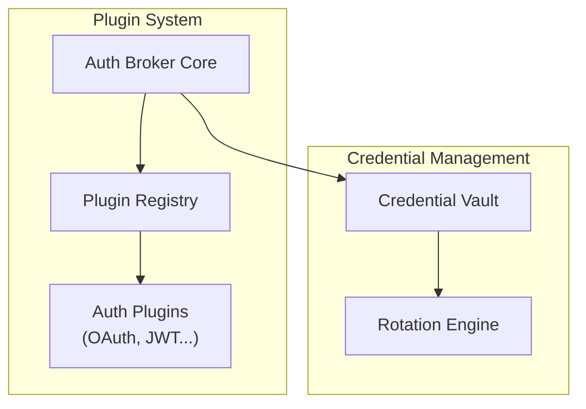

# Future UI Building Blocks: Practical Projects Toward Intelligent Interfaces

## Foundation Layer: The Integration Engine

### Project 1: Universal Auth Broker

**What You're Building**: A service that handles ALL authentication patterns in one place

- OAuth2, JWT, SAML, API keys, webhooks - everything
- Auto-refresh tokens, credential vaulting, rotation schedules
- Single interface regardless of auth type
- Plugin architecture for new auth methods
- **Why It Matters**: Every AI concierge needs to connect to dozens of services seamlessly

---

# Universal Auth Broker Implementation

A unified authentication service that handles ALL authentication patterns in one place. Part of the Future UI Building Blocks project.

## Features

- 🔐 **Universal Auth Support**: OAuth2, JWT, SAML, API keys, webhooks - everything
- 🔄 **Auto-refresh**: Automatic token refresh before expiration
- 🔑 **Credential Vault**: Secure storage with rotation schedules
- 🔌 **Plugin Architecture**: Easy to add new auth methods
- 🚀 **High Performance**: Sub-100ms response times
- 🛡️ **Enterprise Ready**: Audit logging, compliance features, multi-tenant isolation

## Quick Start

```bash
# Install dependencies
npm install

# Copy environment variables
cp .env.example .env

# Run in development mode
npm run dev

# Run smoke tests
npm run test:smoke
```

## Architecture



## API Overview

### Create Connection
```bash
POST /v1/connections
{
  "name": "GitHub Integration",
  "service": "github",
  "endpoint": "https://api.github.com",
  "authConfig": {
    "type": "oauth2",
    "clientId": "your-client-id",
    "clientSecret": "your-client-secret",
    "scopes": ["read:user", "repo"]
  }
}
```

### Auto-Detect Auth
```bash
POST /v1/plugins/detect
{
  "endpoint": "https://api.example.com"
}
```

### List Plugins
```bash
GET /v1/plugins
```

## Plugin Development

To create a new auth plugin:

1. Implement the `AuthPlugin` interface
2. Register it in the plugin registry
3. Define config schema using Zod

Example:
```typescript
export class MyAuthPlugin implements AuthPlugin {
  readonly id = 'my-auth';
  readonly name = 'My Auth Method';
  readonly version = '1.0.0';
  
  async detectAuthRequirements(endpoint: URL) {
    // Detect if this endpoint uses your auth method
  }
  
  async startAuth(config: AuthConfig) {
    // Start authentication flow
  }
  
  // ... implement other required methods
}
```

## Security

- All credentials encrypted using AES-256-GCM
- Support for Hardware Security Modules (HSM)
- Audit logging for all credential access
- Rate limiting and tenant isolation

## Development Status

Current implementation includes:
- ✅ Core plugin system
- ✅ OAuth2 plugin (basic)
- ✅ JWT plugin (stub)
- ✅ API structure
- ⏳ Credential vault (pending)
- ⏳ Rotation engine (pending)
- ⏳ Database integration (pending)

## Contributing

See [DESIGN.md](./DESIGN.md) and [SPEC.md](./SPEC.md) for detailed architecture and API specifications.

## License

MIT