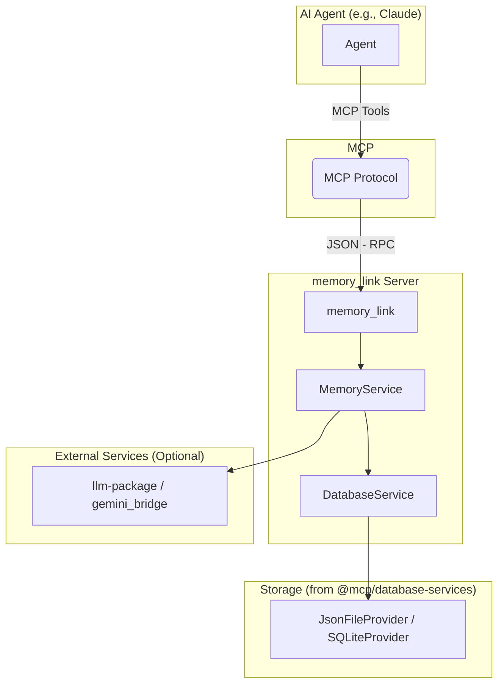

# `memory_link`: Development Plan

A phased development plan for creating a focused, persistent memory MCP server.

## 1. Vision & Core Goals

The primary vision is to distill the powerful but complex concepts from the ./references/ `McpMemoryServer` draft into a practical,
self-contained, and immediately useful MCP tool. This server will act as a persistent, queryable memory store for an AI
agent, enabling it to learn and retain information across sessions.

Our development will be guided by these core principles:

* **Focused & Pragmatic:** Start with a simple, robust core. Each phase should deliver a tangible, usable improvement.
* **Leverage Existing Work:** Make full use of the excellent, modular `../../packages/` libraries already designed:
  `@mcp/database-services` for storage and `@mcp/llm-package` for intelligence.
* **Phased & Iterative:** Build in manageable stages, allowing for thorough testing and refinement at each step before adding
  more complexity.

## 2. High-Level Architecture

The `memory_link` server will be a self-contained MCP application that integrates with your existing packages.



## 3. Development Phases

### Phase 1: The Core Memory Service (Foundation)

**Goal:** Establish a simple, robust, document-based memory store. This phase focuses on creating, retrieving, updating,
and deleting memories.

#### Data Model

A single, flexible `MemoryRecord` will be the core data structure.

```typescript
export interface MemoryRecord {
    /** A unique UUID for the memory. */
    id: string;
    /** The core text content of the memory. */
    content: string;
    /** A 0-10 score of the memory's importance. */
    importance: number;
    /** An array of strings for categorization and filtering. */
    tags: string[];
    /** Vector embedding for semantic search (added in Phase 2). */
    embedding?: number[];
    /** ISO timestamp of when the memory was created. */
    createdAt: string;
    /** ISO timestamp of the last time the memory was accessed. */
    lastAccessed: string;
    /** A simple counter for how many times the memory has been accessed. */
    accessCount: number;
}
```

#### MCP Tools (V1)

* `remember(content: string, importance: number, tags: string[])`: Creates and stores a new `MemoryRecord`.
* `recall(query: string, tags?: string[], limit?: number)`: Performs a simple keyword-based search on memory `content`
  and `tags`.
* `get_memory(id: string)`: Retrieves a single memory by its unique ID.
* `list_memories(tags?: string[], limit?: number, sortBy?: 'createdAt'|'lastAccessed'|'importance')`: Lists memories
  with filtering and sorting.
* `update_memory(id: string, content?: string, importance?: number, tags?: string[])`: Modifies an existing memory.
* `forget(id: string)`: Deletes a memory by its ID.

---

### Phase 2: Enhanced Retrieval & Simple Decay

**Goal:** Make the memory "smarter" by introducing semantic search and a basic mechanism for forgetting less important
information over time.

#### Key Features

1. **Vector Search Integration:**
    * **On `remember`:** When a memory is created, use the `llm-package` (or `gemini_bridge`) to generate a vector
      embedding for the `content` and store it in the `MemoryRecord`.
    * **On `recall`:** The `recall` tool will first generate an embedding for the search `query`. It will then perform a
      cosine similarity search against all stored embeddings to find the most semantically relevant memories, returning
      them ranked by similarity.

2. **Simple Importance Decay:**
    * Implement a periodic background process (e.g., `setInterval`) that runs every time it's accessed.
    * This process iterates through all memories and applies a decay function to their `importance` score based on
      `lastAccessed` and `accessCount`.
    * Memories that fall below a configured importance threshold (e.g., 1.0) are automatically deleted / consolidated.

#### MCP Tool Updates (V2)

* `recall`: Logic is upgraded to use vector search for superior semantic retrieval.
* `recalculate_importance(id: string)`: A new manual tool to re-run the importance scoring algorithm on a specific
  memory.
* `run_decay_cycle()`: A new manual tool to trigger the decay and pruning process on demand.

---

### Phase 3: Advanced Concepts (Consolidation & Linking)

**Goal:** Introduce the ability to create higher-level, abstract memories from clusters of related, lower-level
memories. This mirrors the concept of short-term to long-term memory consolidation.

#### Key Features

1. **Memory Consolidation:**
    * A new `consolidate_memories` tool will identify a cluster of related memories (using vector search from Phase 2).
    * It will send the content of these memories to a powerful LLM (like `gemini-bridge`).
    * The LLM will be prompted to generate a concise, abstract principle or summary from the provided memories.
    * This summary is then stored as a *new* `MemoryRecord` with a high importance score and a `consolidated` tag.

2. **Memory Linking:**
    * To create a simple knowledge graph, the new consolidated memory will store the IDs of its sources in a metadata
      field (e.g., `source_ids: ['id1', 'id2']`).
    * This creates a traceable link from an abstract principle back to the concrete observations that formed it, without
      the initial overhead of a dedicated graph database.

#### MCP Tool Updates (V3)

* `consolidate_memories(topic: string)`: A new tool that finds related memories on a given topic and attempts to create
  a new, more abstract summary memory from them.
* `get_related_memories(id: string)`: A new tool that, given a memory ID, can trace its lineage—finding the source
  memories it was built from or the consolidated memory it contributed to.

## 4. Synergy with Other MCP Tools

This architecture is designed for powerful interoperability between your tools:

* **`browser_debug` -> `memory_link`**: The browser debugger can capture key console errors or user interactions and use
  `memory_link.remember()` to create a persistent record of the event for the AI to learn from.
* **`memory_link` -> `gemini_bridge`**: The memory server can offload heavy-duty AI tasks (embedding generation,
  consolidation, abstraction) to the `gemini_bridge`, keeping its own logic focused on memory management and retrieval.
    * NOTE: The 'gemini_bridge' cannot be used as a general purpose llm bridge yet, but check out the llm-package for
    possible usage, or consolidation, or just planning/reference.

## 5. Future Considerations (Beyond Phase 3)

This plan provides a solid foundation. Once these phases are complete, we can explore the more advanced concepts from
the original `McpMemoryServer` draft:

* **Dedicated Knowledge Graph:** Migrating from linked documents to a true graph database (e.g., Neo4j) for complex
  relationship queries.
* **Explicit Memory Layers:** Evolving from a single collection with metadata to separate storage for short, medium, and
  long-term memories if performance requires it.
* **Advanced Analytics & UI:** Building tools to visualize the memory graph, track importance decay, and analyze
  learning patterns over time.